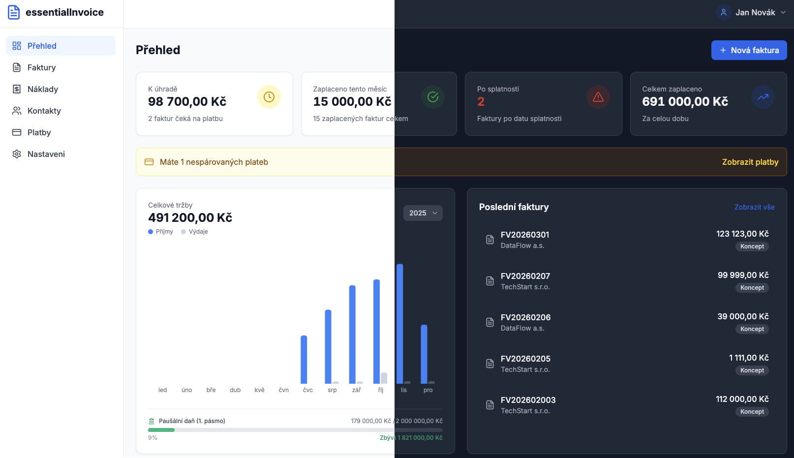

# Essential Invoice

A lightweight, self-hosted invoicing web application designed for Czech freelancers and small businesses. Features include PDF invoice generation with QR payment codes, SMTP email sending, and automatic bank payment matching via bank email notifications parsing.

<p align="center">
  
</p>

## Features

- **AI-Powered Features**: Smart payment matching (only if native parsing fails), invoice insights, Czech tax advisor chatbot (via Perplexity AI)
- **Invoice Management**: Create, edit, duplicate, and send invoices with automatic numbering
- **Recurring Invoices**: Monthly recurring invoice templates with optional auto-send
- **Expense Tracking**: Track business expenses with PDF attachments and automatic numbering
- **Client Management**: Store and manage client contacts with ARES API integration for Czech companies
- **PDF Generation**: Professional Czech invoice templates with QR payment codes (SPAYD format), VAT/non-VAT payer support
- **Email Integration**: Send invoices via SMTP, receive bank notifications via IMAP
- **Bank Payment Matching**: Automatic matching of Air Bank payment notifications to invoices
- **Password Reset**: Email-based password recovery with secure token flow
- **Welcome Emails**: Automatic welcome email on registration (when global SMTP configured)
- **Onboarding Wizard**: Guided 2-step setup after registration to collect company and bank details
- **Account Deletion**: Self-service account deletion with password confirmation
- **Dashboard**: Overview of revenue, outstanding payments, and recent activity
- **Multi-currency**: Support for CZK and EUR
- **Docker Ready**: Single command deployment with docker compose
- **Helm Chart**: Kubernetes deployment with built-in PostgreSQL StatefulSet

## Quick Start

### Prerequisites

- Docker and Docker Compose installed

### Run

```bash
git clone https://github.com/yourusername/essential-invoice.git
cd essential-invoice
cp .env.example .env
# Edit .env - set JWT_SECRET and DB_PASSWORD
docker compose up -d
```

Access the application at `http://localhost:8080` and register your first user account.

### Kubernetes

```bash
cd helm-chart
helm install essential-invoice . \
  --namespace essential-invoice --create-namespace \
  --set jwtSecret=$(openssl rand -base64 32) \
  --set postgresql.auth.password=$(openssl rand -base64 16)
```

See [helm-chart/README.md](helm-chart/README.md) for full Helm configuration.

## Development

```bash
docker compose up -d db          # Start PostgreSQL
cd backend && bun install && bun run dev    # Backend (port 3001)
cd frontend && bun install && bun run dev   # Frontend (port 5173)
```

Set `CORS_ORIGIN=http://localhost:5173` in `.env` for local development.

See [docs/development.md](docs/development.md) for full setup, testing, and project structure.

## Documentation

| Document | Description |
|----------|-------------|
| [Architecture](docs/architecture.md) | Backend, frontend, Helm chart structure, integrations, security |
| [API Reference](docs/api-reference.md) | All REST API endpoints |
| [Configuration](docs/configuration.md) | Environment variables, SMTP, IMAP, AI setup |
| [Deployment](docs/deployment.md) | Docker, Helm/Kubernetes, backup & restore |
| [Development](docs/development.md) | Local setup, testing, project structure, contributing |
| [Troubleshooting](docs/troubleshooting.md) | Common issues and debugging |

## License

MIT License - See LICENSE file for details.

## Support

For issues and feature requests, please use the GitHub issue tracker.
