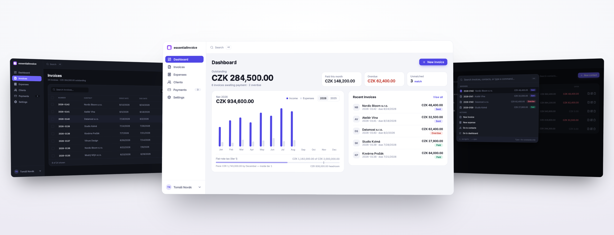

# Essential Invoice

A lightweight, self-hosted invoicing web application designed for Czech freelancers and small businesses. Features include PDF invoice generation with QR payment codes, SMTP email sending, and automatic bank payment matching via bank email notifications parsing.

<p align="center">
  
</p>

## Features

- **AI Features**: Personalized Czech tax advisor with live web search, expense extraction from uploaded receipts/invoices, and AI-drafted payment reminders (via OpenRouter or any OpenAI-compatible API)
- **Invoice Management**: Create, edit, duplicate, and send invoices with automatic numbering
- **Per-line VAT**: Mixed VAT rates, exemption reasons and domestic reverse charge, with consistent totals in invoices, recurring templates and PDFs
- **Accountant Exports**: Period ZIP packages with CSV summaries, invoice PDFs, expense attachments and ISDOC 6.0.2 files; individual ISDOC downloads
- **Recurring Invoices**: Monthly recurring invoice templates with optional auto-send
- **Expense Tracking**: Track business expenses with PDF attachments and automatic numbering
- **Client Management**: Store and manage client contacts with ARES API integration for Czech companies
- **PDF Generation**: Professional Czech invoice templates with QR payment codes (SPAYD format), VAT/non-VAT payer support
- **Email Integration**: Send invoices via SMTP, receive bank notifications via IMAP
- **Bank Payment Matching**: Automatic matching of Air Bank payment notifications to invoices
- **Password Reset**: Email-based password recovery with secure token flow
- **Welcome Emails**: Automatic welcome email on registration (when global SMTP configured)
- **Onboarding Wizard**: Guided 2-step setup after registration to collect company and bank details
- **Account Deletion**: Self-service account deletion with password confirmation
- **Dashboard**: Overview of revenue, outstanding payments, and recent activity
- **Multi-language**: Czech and English UI, PDFs, and emails with language setting in profile
- **Multi-currency**: Support for CZK and EUR
- **Docker Ready**: Single command deployment with docker compose
- **Helm Chart**: Kubernetes deployment with built-in PostgreSQL StatefulSet

### VAT and accounting workflow

Set the VAT rate and treatment on each invoice line. Exempt lines require a reason/legal reference; domestic reverse-charge lines require the supply code and show “Daň odvede zákazník” on Czech PDFs. The default rate applies to lines without their own rate. Tax-point dates can be set separately from issue dates.

The item VAT selector inherits your saved default; exemption and reverse-charge fields appear only when selected. The tax breakdown can be expanded, and the tax-point date follows the issue date unless overridden. New invoices for non-VAT payers start at 0% with VAT controls hidden.

Open **Settings → Exports** to select a period by issue or tax-point date and download the ZIP. It includes issued invoices (sent, overdue, paid) and expenses, with a limit of 500 documents / 100 MB. Use **Download → PDF / ISDOC** on an invoice to download an individual file immediately. This release exports accounting records; it does not generate VAT return/control-statement XML or import ISDOC. See the [API reference](docs/api-reference.md#accountant-export) for package contents and format details.

## Quick Start

### Prerequisites

- Docker and Docker Compose installed

### Run

```bash
git clone https://github.com/yourusername/essential-invoice.git
cd essential-invoice
cp .env.example .env
# Edit .env - set JWT_SECRET and DB_PASSWORD
docker compose up -d
```

Access the application at `http://localhost:8080` and register your first user account.

### Kubernetes

```bash
cd helm-chart
helm install essential-invoice . \
  --namespace essential-invoice --create-namespace \
  --set jwtSecret=$(openssl rand -base64 32) \
  --set postgresql.auth.password=$(openssl rand -base64 16)
```

See [helm-chart/README.md](helm-chart/README.md) for full Helm configuration.

## Development

```bash
docker compose up -d db          # Start PostgreSQL
cd backend && bun install && bun run dev    # Backend (port 3001)
cd frontend && bun install && bun run dev   # Frontend (port 5173)
```

Set `CORS_ORIGIN=http://localhost:5173` in `.env` for local development.

See [docs/development.md](docs/development.md) for full setup, testing, and project structure.

## Documentation

| Document | Description |
|----------|-------------|
| [Architecture](docs/architecture.md) | Backend, frontend, Helm chart structure, integrations, security |
| [API Reference](docs/api-reference.md) | All REST API endpoints |
| [Configuration](docs/configuration.md) | Environment variables, SMTP, IMAP, AI setup |
| [Deployment](docs/deployment.md) | Docker, Helm/Kubernetes, backup & restore |
| [Development](docs/development.md) | Local setup, testing, project structure, contributing |
| [Troubleshooting](docs/troubleshooting.md) | Common issues and debugging |
| [Planned rate limiting](docs/planned-rate-limiting.md) | Deferred account quotas, proxy support, and session recovery |

## License

MIT License - See LICENSE file for details.

## Support

For issues and feature requests, please use the GitHub issue tracker.
